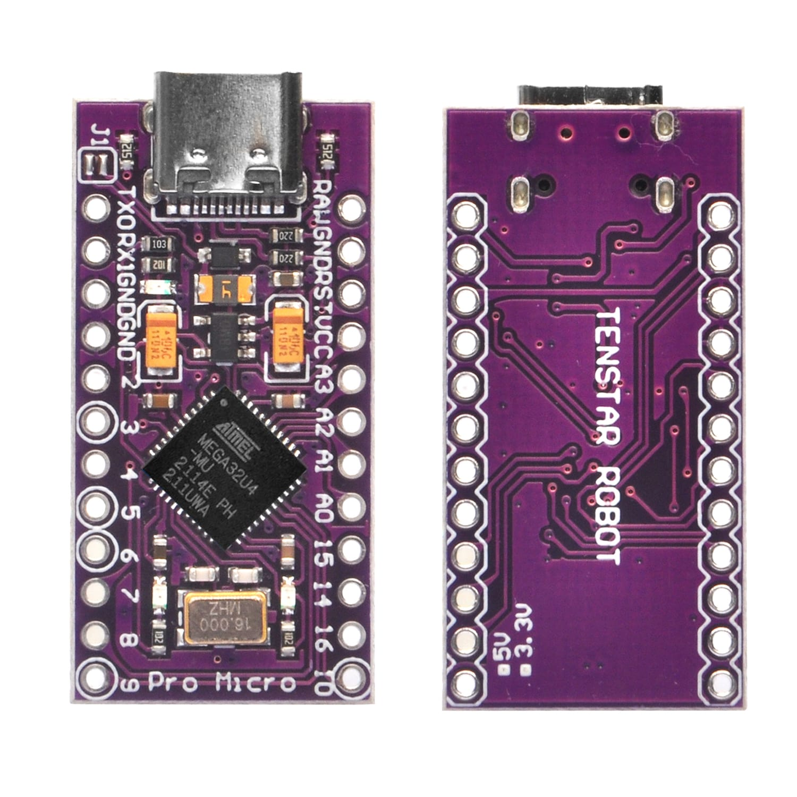
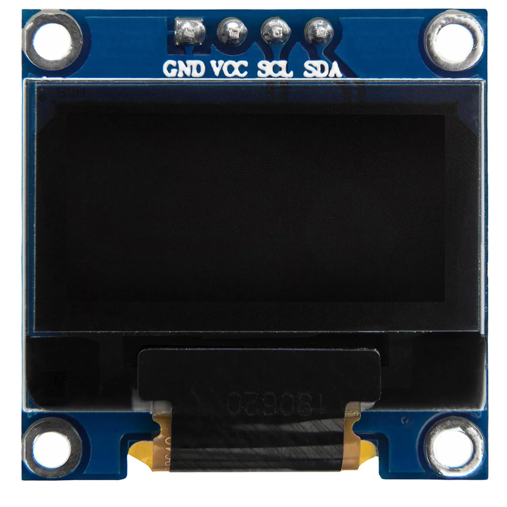
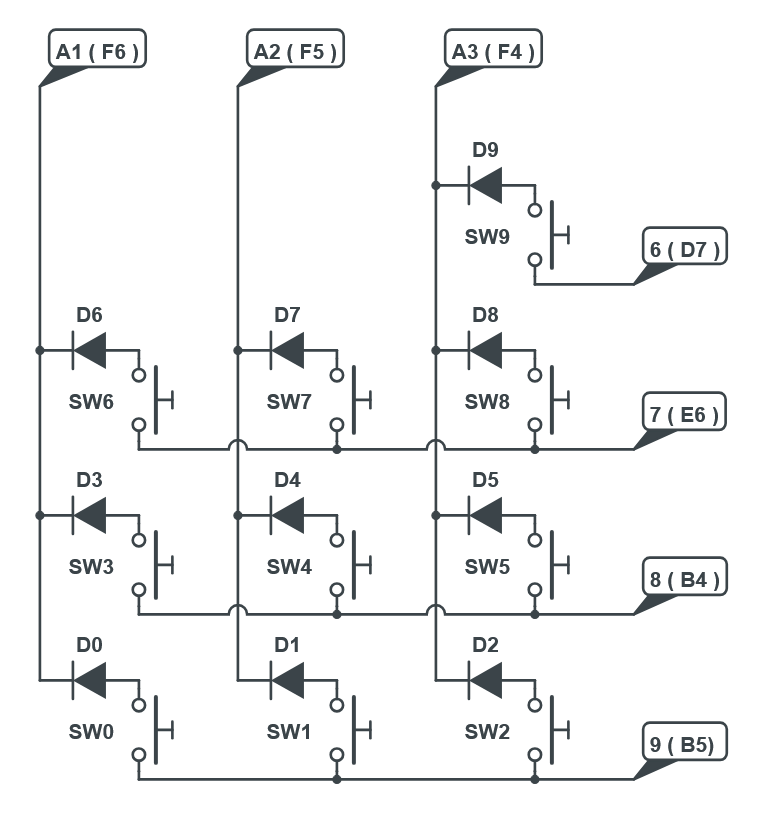

# Beanie Macropad
QMK-based Macropad project whith support for VIA & VIAL

A small 10-key macropad (4x3 matrix) with a 0.96" SSD1306 I2C OLED.  
This repository contains the hardware files and instructions to build, compile and flash the Beanie firmware using QMK.

## Features
- 4x3 switch matrix (10 keys)
- Supports simple QMK, VIA & VIAL
- SSD1306 128×64 I2C OLED display
- Pro Micro (ATmega32U4) with Caterina bootloader

## Hardware

- Controller: Pro Micro (ATmega32U4)
- Display: SSD1306 128×64 Mono (I2C)
- Switches: Outemo Browns
- Miscellaneous parts: diodes, wires
- 3D Printed Case
  

---

# Quick start
Familiarity with QMK is advised.   
Usage of QMK CLI tool is highly recommended for new users as it installs flashing tools for the Microcontrollers. 
See the [build environment setup](https://docs.qmk.fm/#/getting_started_build_tools) 
And the [make instructions](https://docs.qmk.fm/#/getting_started_make_guide) for more information. 
Brand new to QMK? Start with the [Complete Newbs Guide](https://docs.qmk.fm/#/newbs). 

# First, the circuit and case
## The case
Feel free to 3D design and assemble your own macropad case.   
Several tools are available to help design a keypad:  
  - To have some help designing your own keypad layout: [`keyboard layout editor`](https://www.keyboard-layout-editor.com/)    
  - To convert the keypad layout into a key matrix midplate drwaing for the switches: [`Keebio`](https://plate.keeb.io/)  
After getting the midplate files, you can design the full case.   

## The circuit
The circuit is a simple 4x3 matrix with 2 unpopulated switches to give space for the Oled.  
It is recommended to only solder the Diodes and wiring after verifying everything fits inside the case.  
Diodes user were 1N4148.  
Switches were Outemo Browns.  

The Oled Screen was connected to the VCC, GND, SDA and SCL lines of the Pro micro.  

>[!WARNING]
> Remember to not permanently close the case before flashing any software.    
> Flashing sofware may require access to the `Reset` pin, plan accordingly.  
> Alternatives can be provided:  
> - Extra button for reset
> - Hole in case to access reset pin (connecting it to the Usb shield Ground) 

# Secondly QMK, VIA or VIAL?

## [QMK](https://qmk.fm/) & [VIA](https://www.caniusevia.com/)
For simple [QMK](https://qmk.fm/) Macropad (where keycodes cannot be changed unless you change them in the code and flash a new firmware);  
Or just [VIA](https://www.caniusevia.com/) compatibility (here you can use the default keycodes or change them using the VIA online tool);  
  - First [install qmk CLI](https://docs.qmk.fm/#/getting_started_build_tools). 
  - Then copy the [beanie folder](beanie) into the keyboards folder on the QMK repo clone location. 
  - Lastly, for how to build and flash see the Macropad README notes: [keyboards/beanie/readme.md](beanie/readme.md) or the [CLI Flashing on the Website ](https://docs.qmk.fm/newbs_flashing#flash-your-keyboard-from-the-command-line) 

## [VIAL](https://get.vial.today/)
For [VIAL](https://get.vial.today/) compatibility (you have similar functionality as to VIA, however there is also an offline software to change keycodes);  
Although it comes with the drawback of a higher memory footprint, I personally prefer using VIAL due to the offline editor.  
  - To be able to compile and flash VIAL you need first to [install qmk CLI](https://docs.qmk.fm/#/getting_started_build_tools). 
  - Then clone [vial-qmk repo](https://github.com/vial-kb/vial-qmk) and copy the [beanie folder](beanie) into the repo keyboards folder. 
  - Finally follow the build guidelines in [VIAL Webpage](https://get.vial.today/docs/porting-to-vial.html) 
  -  `make beanie:vial` will compile the vial code  
  -  `make beanie:vial:flash` will compile vial code and program the microcontroller  
    
The VIAL Macropad JSON file is provided in folder VIAL. 

 
